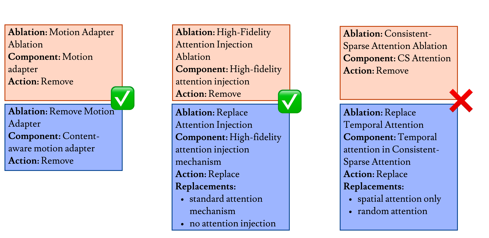

<style type="text/css">
.ablationbench {
  background: linear-gradient(to right, #0C69DA,rgb(129, 176, 233));
  -webkit-text-fill-color: transparent;
  -webkit-background-clip: text;
  font-weight: bold;
  font-style: italic;
}

.authorablation {
  background: linear-gradient(to right, rgb(196, 124, 235),rgb(196, 124, 235));
  -webkit-text-fill-color: transparent;
  -webkit-background-clip: text;
  font-style: italic;
}

.reviewerablation {
  background: linear-gradient(to right, #60BF00, #60BF00);
  -webkit-text-fill-color: transparent;
  -webkit-background-clip: text;
  font-style: italic;
}
</style>
# AblationBench


> Can models help automate the design of ablation experiments in scientific papers? To explore this, we introduce <span class="ablationbench">AblationBench</span>, a benchmark for evaluating models on ablation planning in empirical AI research. It includes two tasks: <span class="authorablation">AuthorAblation</span>, where the model proposes ablations from a method section, and <span class="reviewerablation">ReviewerAblation</span>, where it suggests missing ablations in a full paper. Across 83 papers in <span class="authorablation">AuthorAblation</span> and 350 papers in <span class="reviewerablation">ReviewerAblation</span>, we evaluate models using automatic LM-based judges and find that even the **best systems identify only 38% of ground-truth ablations**, highlighting how *challenging* and *open* this task remains.

<center></center>

This is the project page of AblationBench, it contains the leaderboards as well as brief explanation about our benchmark and evaluation paradigm.
It also contains all the trajectories for the model used in our evaluation.

For more information please refer to our [paper](https://www.arxiv.org/abs/2507.08038).

We are also completely open-source! Our dataset can be found on [HuggingFace](https://huggingface.co/collections/ai-coscientist/ablationbench-682701a2c1eafb87b1b087ea) and our evaluation suite can be found on [GitHub](https://github.com/ai-scientist-bench/ablation-bench) [](https://github.com/ai-scientist-bench/ablation-bench).

## Leaderboard

The leaderboard shows all model results, with detailed scores per dataset in the <span class="authorablation">AuthorAblation</span> and <span class="reviewerablation">ReviewerAblation</span> tabs.

<!-- tabs:start -->

#### **<span class="ablationbench">AblationBench</span>**

| Model                             | F1 Score |
|----------------------------------|----------|
| LM-Planner w/ GPT-4o             | **0.31**     |
| LM-Planner w/ Gemini 2.5 Flash   | 0.30     |
| LM-Planner w/ Claude 3.5 Sonnet  | 0.30     |
| LM-Planner w/ o3-mini            | 0.29     |
| Agent-Planner w/ Claude 3.5 Sonnet | 0.29   |
| Agent-Planner w/ GPT-4o          | 0.29     |
| LM-Planner w/ Llama 3.1 405B     | 0.27     |
| Agent-Planner w/ Llama 3.1 405B  | 0.26     |

#### **<span class="authorablation">AuthorAblation</span> Only**

| Model                             | F1 Score |
|----------------------------------|----------|
| LM-Planner w/ Claude 3.5 Sonnet  | **0.40**     |
| LM-Planner w/ Gemini 2.5 Flash   | 0.36     |
| LM-Planner w/ o3-mini            | 0.35     |
| LM-Planner w/ GPT-4o             | 0.34     |
| Agent-Planner w/ Claude 3.5 Sonnet | 0.32   |
| Agent-Planner w/ GPT-4o          | 0.30     |
| Agent-Planner w/ Llama 3.1 405B  | 0.28     |
| LM-Planner w/ Llama 3.1 405B     | 0.26     |


#### **<span class="reviewerablation">ReviewerAblation</span> Only**

| Model                             | F1 Score |
|----------------------------------|----------|
| LM-Planner w/ Llama 3.1 405B     | **0.27**     |
| LM-Planner w/ GPT-4o             | **0.27**     |
| Agent-Planner w/ GPT-4o          | **0.27**     |
| Agent-Planner w/ Claude 3.5 Sonnet | 0.25   |
| LM-Planner w/ Gemini 2.5 Flash   | 0.24     |
| Agent-Planner w/ Llama 3.1 405B  | 0.24     |
| LM-Planner w/ o3-mini            | 0.22     |
| LM-Planner w/ Claude 3.5 Sonnet  | 0.19     |


<!-- tabs:end -->


## Task Instances

We look into two tasks in automating ablations: 
1. Assisting ***authors***: proposing ablation experiments given a written method section.
2. Assisting ***reviewers***: proposing missing ablation experiments of a given paper.

<!-- tabs:start -->

#### **<span class="authorablation">AuthorAblation</span>**

In <span class="authorablation">AuthorAblation</span> the task is generating an ablation plan given a paper's title, abstract, and truncated content up to the method section.

The output is a structured JSONL file containing up to k ablation entries. Each entry should describe the removal or modification of a specific component of the proposed method, aiming to assess its individual contribution.

<details>
<summary>Example output for MotionEditor paper from AuthorAblation dev split</summary>

```json
[
    {
        "name": "CS Attention Ablation",
        "ablated_part": "CS Attention",
        "action": "REPLACE",
        "replacement": ["Sparse Attention"],
        "metrics": ["visual quality"]
    },
    {
        "name": "Cross Attention in Motion Adapter Ablation",
        "ablated_part": "Cross attention in motion adapter",
        "action": "REMOVE",
        "metrics": ["visual quality"]
    },
    {
        "name": "Motion Adapter Ablation",
        "ablated_part": "Motion adapter",
        "action": "REMOVE",
        "metrics": ["visual quality"]
    },
    {
        "name": "High-Fidelity Attention Injection Ablation",
        "ablated_part": "High-fidelity attention injection",
        "action": "REMOVE",
        "metrics": ["visual quality"]
    },
    {
        "name": "Skeleton Alignment Ablation",
        "ablated_part": "Skeleton alignment",
        "action": "REMOVE",
        "metrics": ["visual quality"]
    }
]
```
</details>

For this task, we collect 83 papers, that span across 14 conferences and include 230 human-annotated ablation experiments from the original papers.

#### **<span class="reviewerablation">ReviewerAblation</span>**

In <span class="reviewerablation">ReviewerAblation</span> the task is given a paper’s title, abstract, and full preprint, to generate k missing ablations—experiments that were not reported in the paper but should have been included.

For this task, we collect 350 submissions and reviews from [ICLR](https://iclr.cc) (2023-2025), where the [reviews](https://openreview.net) contain suggestion for missing ablation experiments.

<details>
<summary>An example for review containing a suggestion for missing ablation experiment</summary>

> ... I would expect more ablation studies of the choices in the proposed methods: for example, how does the number of iterations affect the results? ...

</details>


<!-- tabs:end -->


## Evaluating AblationBench

To support automatic evaluation, we design an LM-based judge that compares the GT ablations to the generated ones and decides whether each one has a match.

To evaluate how well the judges perform, we also provide a dedicated dataset, *JudgeEval*, consisting of *AuthorEval* and *ReviewerEval*, with manually labeled examples for both tasks.

Our best judge achieves 0.78 F1 score on the JudgeEval dataset using o3-mini: on the AuthorEval we achieve 0.81 F1 score and on the ReviewerEval we acheive 0.74 F1 score.

We use the majority vote judge on three models for final evaluation, to address any potential bias of a model rates its own generations.

The image below shows four examples of how our matching criteria works:




## Citation

```bibtex
@misc{abramovich2025ablationbenchevaluatingautomatedplanning,
      title={AblationBench: Evaluating Automated Planning of Ablations in Empirical AI Research}, 
      author={Talor Abramovich and Gal Chechik},
      year={2025},
      eprint={2507.08038},
      archivePrefix={arXiv},
      primaryClass={cs.CL},
      url={https://arxiv.org/abs/2507.08038}, 
}
```