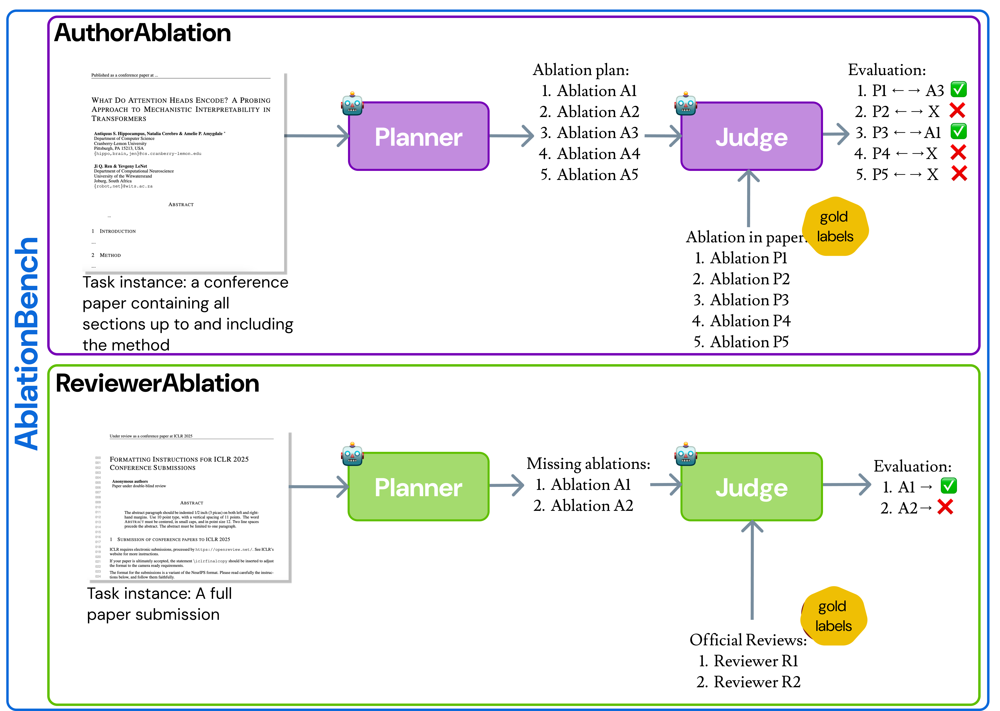

<style type="text/css">
.ablationbench {
  background: linear-gradient(to right, #0C69DA,rgb(129, 176, 233));
  -webkit-text-fill-color: transparent;
  -webkit-background-clip: text;
  font-weight: bold;
  font-style: italic;
}

.authorablation {
  background: linear-gradient(to right, rgb(196, 124, 235),rgb(196, 124, 235));
  -webkit-text-fill-color: transparent;
  -webkit-background-clip: text;
  font-style: italic;
}

.reviewerablation {
  background: linear-gradient(to right, #60BF00, #60BF00);
  -webkit-text-fill-color: transparent;
  -webkit-background-clip: text;
  font-style: italic;
}
</style>
# AblationBench


> Can models help automate the design of ablation experiments in scientific papers? To explore this, we introduce <span class="ablationbench">AblationBench</span>, a benchmark for evaluating models on ablation planning in empirical AI research. It includes two tasks: <span class="authorablation">AuthorAblation</span>, where the model proposes ablations from a method section, and <span class="reviewerablation">ReviewerAblation</span>, where it suggests missing ablations in a full paper. Across 83 papers in <span class="authorablation">AuthorAblation</span> and 350 papers in <span class="reviewerablation">ReviewerAblation</span>, we evaluate models using automatic LM-based judges and find that even the **best systems identify only 29% of ground-truth ablations**, highlighting how *challenging* and *open* this task remains.

<center></center>

## Leaderboard

The leaderboard shows all model results, with detailed scores per dataset in the <span class="authorablation">AuthorAblation</span> and <span class="reviewerablation">ReviewerAblation</span> tabs.

<!-- tabs:start -->

#### **<span class="ablationbench">AblationBench</span>**

| Model                             | F1 Score |
|----------------------------------|----------|
| LM-Planner w/ GPT-4o             | 0.22     |
| LM-Planner w/ Claude 3.5 Sonnet  | 0.21     |
| LM-Planner w/ Llama 3.1 405B     | 0.19     |
| LM-Planner w/ o3-mini            | 0.22     |
| LM-Planner w/ Gemini 2.5 Flash   | **0.24**     |
| Agent-Planner w/ GPT-4o          | 0.18     |
| Agent-Planner w/ Claude 3.5 Sonnet | 0.19   |
| Agent-Planner w/ Llama 3.1 405B  | 0.17     |

#### **<span class="authorablation">AuthorAblation</span> Only**

| Model                             | F1 Score |
|----------------------------------|----------|
| LM-Planner w/ GPT-4o             | 0.22     |
| LM-Planner w/ Claude 3.5 Sonnet  | 0.23     |
| LM-Planner w/ Llama 3.1 405B     | 0.17     |
| LM-Planner w/ o3-mini            | **0.26**     |
| LM-Planner w/ Gemini 2.5 Flash   | **0.26**     |
| Agent-Planner w/ GPT-4o          | 0.17     |
| Agent-Planner w/ Claude 3.5 Sonnet | 0.17   |
| Agent-Planner w/ Llama 3.1 405B  | 0.14     |


#### **<span class="reviewerablation">ReviewerAblation</span> Only**

| Model                             | F1 Score |
|----------------------------------|----------|
| LM-Planner w/ GPT-4o             | 0.22     |
| LM-Planner w/ Claude 3.5 Sonnet  | 0.18     |
| LM-Planner w/ Llama 3.1 405B     | 0.20     |
| LM-Planner w/ o3-mini            | 0.18     |
| LM-Planner w/ Gemini 2.5 Flash   | **0.22**     |
| Agent-Planner w/ GPT-4o          | 0.19     |
| Agent-Planner w/ Claude 3.5 Sonnet | 0.21   |
| Agent-Planner w/ Llama 3.1 405B  | 0.19     |


<!-- tabs:end -->


## Task Instances

<!-- tabs:start -->

#### **<span class="authorablation">AuthorAblation</span>**

Hello!

#### **<span class="reviewerablation">ReviewerAblation</span>**

Bonjour!

<!-- tabs:end -->


## Citation

```bibtex
@misc{abramovich2025ablationbenchevaluatingautomatedplanning,
      title={AblationBench: Evaluating Automated Planning of Ablations in Empirical AI Research}, 
      author={Talor Abramovich and Gal Chechik},
      year={2025},
      eprint={2507.08038},
      archivePrefix={arXiv},
      primaryClass={cs.CL},
      url={https://arxiv.org/abs/2507.08038}, 
}
```